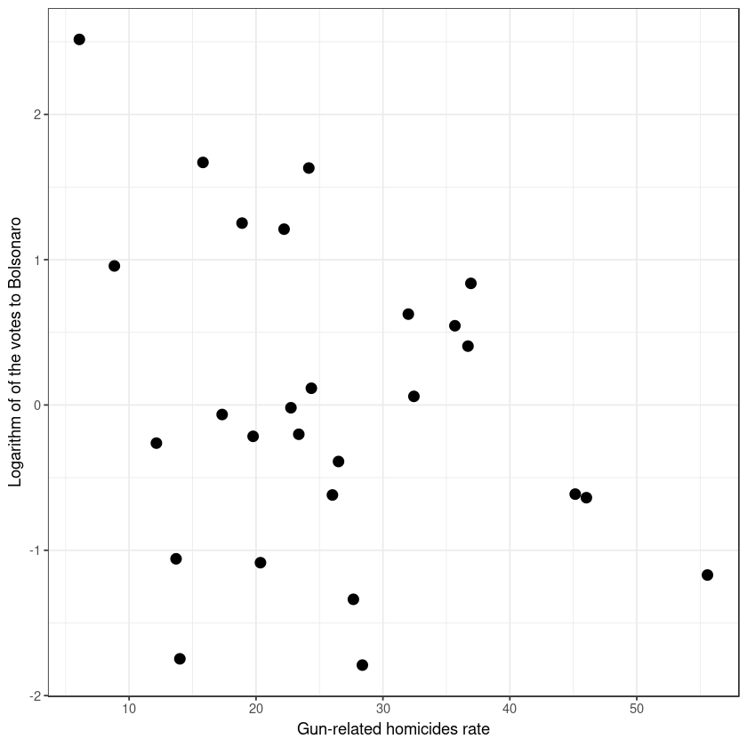
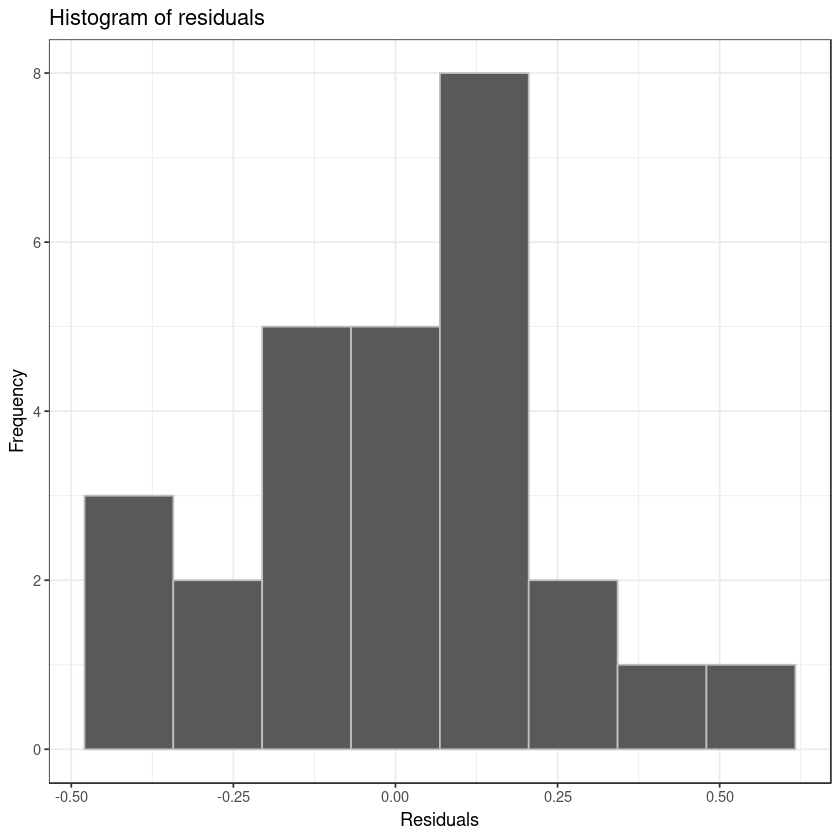

##  Loading libraries


```R
#install.packages(c("psych", "sandwich",
 #                 "lmtest", "ggplot2", "car"))
```


```R
##uncomment above if there's any installaction problem here

library(psych)
library(sandwich)
library(lmtest)
library(ggplot2)
# library(car)
```

## Loading dataset (which should be at [this site](https://dataverse.harvard.edu/dataset.xhtml?persistentId=doi:10.7910/DVN/T1GTLO) )


```R
df_total <- read.csv('../data/data_caio.csv', sep = ',', 
                     fileEncoding = 'utf-8') 

```

## Selecting variables


```R
df <- df_total[c('UF','TAXA.DE.HOMICIDIO.DE.NEGROS',
                 'TAXA.DE.HOMICIDIOS.DE.NÃO.NEGROS',
                 'POPULAÇÃO.EVANGÉLICA',
                 'POPULAÇÃO.TOTAL.2010',
                 'TAXA.DE.HOMICIDIOS.POR.ARMA.DE.FOGO',
                 'VOTAÇÃO.JAIR.BOLSONARO...PSL..PRIMEIRO.TURNO_mi')]
```

## Substituindo nomes das variáveis


```R
colnames(df) <- c('uf','tx_hom_negro','tx_hom_nnegro',
                  'pop_evangelica','populacao','tx_hom_arma',
                  'voto_bolsonaro')

```

## Análise descritiva das variáveis


```R
describe(df[c('voto_bolsonaro','tx_hom_negro',
              'tx_hom_arma','pop_evangelica')])

```


<table>
<thead><tr><th></th><th scope=col>vars</th><th scope=col>n</th><th scope=col>mean</th><th scope=col>sd</th><th scope=col>median</th><th scope=col>trimmed</th><th scope=col>mad</th><th scope=col>min</th><th scope=col>max</th><th scope=col>range</th><th scope=col>skew</th><th scope=col>kurtosis</th><th scope=col>se</th></tr></thead>
<tbody>
	<tr><th scope=row>voto_bolsonaro</th><td>1           </td><td>27          </td><td>1.852878e+00</td><td>2.534352e+00</td><td>9.36494e-01 </td><td>1.391323e+00</td><td>8.876504e-01</td><td>1.66935e-01 </td><td>1.237801e+01</td><td>1.221108e+01</td><td>2.7566164   </td><td> 8.30702124 </td><td>4.877364e-01</td></tr>
	<tr><th scope=row>tx_hom_negro</th><td>2           </td><td>27          </td><td>4.378519e+01</td><td>1.605923e+01</td><td>4.23000e+01 </td><td>4.348696e+01</td><td>1.497426e+01</td><td>1.35000e+01 </td><td>7.900000e+01</td><td>6.550000e+01</td><td>0.2090223   </td><td>-0.53969127 </td><td>3.090601e+00</td></tr>
	<tr><th scope=row>tx_hom_arma</th><td>3           </td><td>27          </td><td>2.566111e+01</td><td>1.171636e+01</td><td>2.41600e+01 </td><td>2.505783e+01</td><td>1.162358e+01</td><td>6.08000e+00 </td><td>5.557000e+01</td><td>4.949000e+01</td><td>0.6142284   </td><td>-0.09248356 </td><td>2.254814e+00</td></tr>
	<tr><th scope=row>pop_evangelica</th><td>4           </td><td>27          </td><td>1.565757e+06</td><td>2.013567e+06</td><td>1.08548e+06 </td><td>1.187697e+06</td><td>1.042999e+06</td><td>1.36480e+05 </td><td>9.937853e+06</td><td>9.801373e+06</td><td>2.7738646   </td><td> 8.41912525 </td><td>3.875111e+05</td></tr>
</tbody>
</table>


## Análise gráficas das variáveis


```R
theme_set(theme_bw()) 
```


```R
ggplot(data=df, aes(voto_bolsonaro)) +
    geom_histogram(bins=10, col="gray") +
        labs(y="Frequency", 
               title="Histogram") 


```


```R

ggplot(data=df, aes(tx_hom_negro)) +
    geom_histogram(bins=10, col="gray") +
        labs(y="Frequency",       title="Histogram") 


```


```R
ggplot(data=df, aes(tx_hom_arma)) +
    geom_histogram(bins=10, col="gray") +
        labs(y="Frequency", 
               title="Histogram") 
```


```R

ggplot(data=df, aes(pop_evangelica)) +
    geom_histogram(bins=10, col="gray") +
        labs(y="Frequency", 
               title="Histogram") 
```


## Ajustando variáveis 


```R
df$log_vbolsonaro <- log(df$voto_bolsonaro)

df$log_pevangelica <- log(df$pop_evangelica)

```

## Visualizando relação entre as variáveis


```R
ggplot(df, aes(x=tx_hom_negro, y=log_vbolsonaro )) + 
  geom_point(size = 3)+ 
labs(y="Logarithm of of the votes to Bolsonaro", 
     x="Black population homicides rate") + 
ggsave("logBolsoBlackpop.png",    dpi = 300)
```

    Saving 6.67 x 6.67 in image


```R
ggplot(df, aes(x=tx_hom_arma, y=log_vbolsonaro )) + 
  geom_point(size = 3 ) +
labs(y="Logarithm of of the votes to Bolsonaro",
     x="Gun-related homicides rate") +
ggsave("logBolsoGunrate.png",    dpi = 300)
```

    Saving 6.67 x 6.67 in image





```R
ggplot(df, aes(x=log_pevangelica, y=log_vbolsonaro )) + 
  geom_point(size = 3 ) + 
labs(y="Logarithm of of the votes to Bolsonaro", 
               x="Log of the Evangelical Population in the EUA") +
ggsave("logBolsologEvan.png",dpi = 300)
```

    Saving 6.67 x 6.67 in image


## Modelo de Regressão Linear


```R
reg <- lm(log_vbolsonaro ~ tx_hom_negro + tx_hom_arma +
            log_pevangelica, data = df)

```


```R
df$predicted <- predict(reg)   # Save the predicted values
df$residuals <- residuals(reg) # Save the residual values
```


```R
## Sumário do modelo
summary(reg)
```


    
    Call:
    lm(formula = log_vbolsonaro ~ tx_hom_negro + tx_hom_arma + log_pevangelica, 
        data = df)
    
    Residuals:
         Min       1Q   Median       3Q      Max 
    -0.46051 -0.13301  0.03142  0.13565  0.49883 
    
    Coefficients:
                      Estimate Std. Error t value Pr(>|t|)    
    (Intercept)     -13.115226   0.852568 -15.383 1.35e-13 ***
    tx_hom_negro     -0.004951   0.008628  -0.574    0.572    
    tx_hom_arma      -0.001532   0.011191  -0.137    0.892    
    log_pevangelica   0.975579   0.055697  17.516 8.52e-15 ***
    ---
    Signif. codes:  0 ‘***’ 0.001 ‘**’ 0.01 ‘*’ 0.05 ‘.’ 0.1 ‘ ’ 1
    
    Residual standard error: 0.2565 on 23 degrees of freedom
    Multiple R-squared:  0.9504,	Adjusted R-squared:  0.9439 
    F-statistic: 146.7 on 3 and 23 DF,  p-value: 3.885e-15


#  Checando pressupostos do modelo:


```R

ggplot(data=df, aes(residuals)) +
    geom_histogram(bins = 8, col="gray") +
        labs(y="Frequency",x = "Residuals",
             title="Histogram of residuals") + 
ggsave("residualshist.png", dpi = 300) 

```

    Saving 6.67 x 6.67 in image





```R
plot(reg,which = 1)
```


```R
ggplot(reg, aes(.fitted, .resid))+
geom_point() + stat_smooth(method="loess")+
geom_hline(yintercept=0, col="red", linetype="dashed")+
xlab("Fitted values")+ylab("Residuals") + 
ggsave("residualsfitted.png", dpi = 300)


```

    Saving 6.67 x 6.67 in image


```R
coeftest(reg,vcov. = vcovHC)
```


    
    t test of coefficients:
    
                       Estimate  Std. Error  t value  Pr(>|t|)    
    (Intercept)     -13.1152259   0.6739656 -19.4598 8.776e-16 ***
    tx_hom_negro     -0.0049509   0.0086899  -0.5697    0.5744    
    tx_hom_arma      -0.0015321   0.0126207  -0.1214    0.9044    
    log_pevangelica   0.9755786   0.0441170  22.1134 < 2.2e-16 ***
    ---
    Signif. codes:  0 ‘***’ 0.001 ‘**’ 0.01 ‘*’ 0.05 ‘.’ 0.1 ‘ ’ 1


